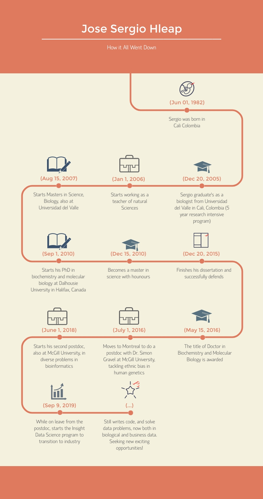

# Summary
A versatile and creative data-scientist and bioinformatician 
fuses a background in biology, biochemistry and computer 
science with knowledge in statistics and laboratory molecular 
biology to deliver quality research products. A doctor in 
biochemistry and molecular biology from Dalhousie University, 
providing innovative ideas, as well as leadership in the 
research team. An effective communicator of scientific 
concepts to a wide audience.

# My Timeline

