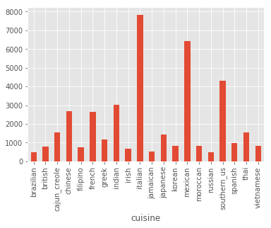
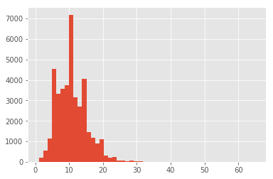
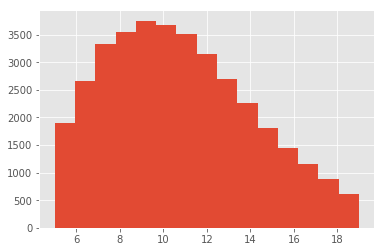
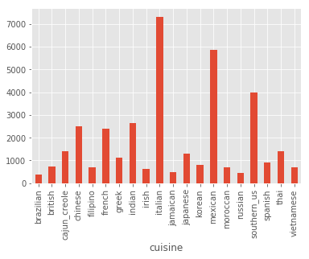
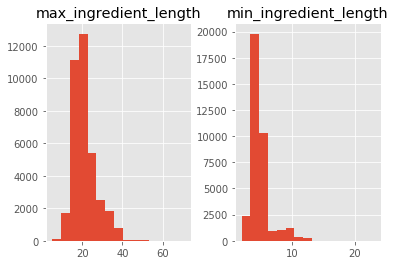
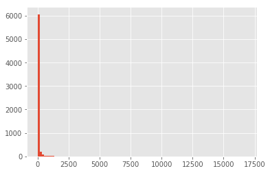
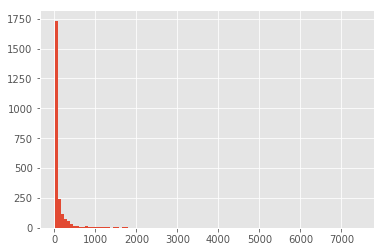
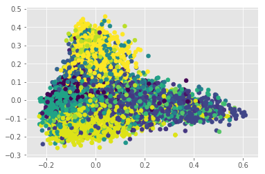
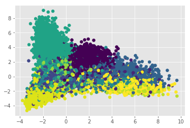

# Recipe2cuisine: Part1
In this post I want to share my experience with an Natural Language 
Processing (NLP) data challenge I tackled at Insight Data Science. 

## The Goal
Imagibe that you've just joined the data team at an online publishing 
company. One of your verticals is a food publication. A product manager 
on your team wants to build a feature for this vertical that enables 
users to query by cuisine, not just by ingredients. Most of your recipes
are unlabeled, and it's infeasible to label them by hand. Luckily, you 
have a small-ish training set of about 30,000 recipes with labeled 
cuisines. Design and execute a method to predict the cuisine of a 
recipe given only its ingredients. For each each major cuisine, what are
the driving ingredients that characterize it? 

## Approach
As always with any data science problem, I have to explore the data, and learn what type of data cleaning/wrangling would be necesary. Our labeled training data looks like this:

```json
[
  {
    "id": 10259,
    "cuisine": "greek",
    "ingredients": [
      "romaine lettuce",
      "black olives",
      "grape tomatoes",
      "garlic",
      "pepper",
      "purple onion",
      "seasoning",
      "garbanzo beans",
      "feta cheese crumbles"
    ]
  },
  {
    "id": 25693,
    "cuisine": "southern_us",
    "ingredients": [
      "plain flour",
      "ground pepper",
      "salt",
      "tomatoes",
      "ground black pepper",
      "thyme",
      "eggs",
      "green tomatoes",
      "yellow corn meal",
      "milk",
      "vegetable oil"
    ]
  }
```

That is, a json file with a labelled cuisine followed by the ingredients
of each recipe. Using pandas and matplotlib, we can plot the number of 
recipes per cuisine:

```python
%matplotlib inline
import numpy as np
import pandas as pd
from sklearn.feature_extraction.text import TfidfTransformer, CountVectorizer, TfidfVectorizer
import matplotlib.pyplot as plt
from sklearn.model_selection import train_test_split
from nltk.stem import WordNetLemmatizer 
from nltk import word_tokenize  
from sklearn.naive_bayes import MultinomialNB, ComplementNB
from sklearn.pipeline import Pipeline
from sklearn.model_selection import cross_validate
from sklearn import metrics
from sklearn.decomposition import PCA

plt.style.use('ggplot')
filename = '../Challenge_Recipe2Cuisine/recipies.json'
recipes = pd.read_json(filename)
print('Minimum number of ingredients:', recipes.ingredients.apply(lambda x: len(x)).min())
print('Maximum number of ingredients:', recipes.ingredients.apply(lambda x: len(x)).max())
print('Number of cuisines:', recipes.cuisine.unique().shape[0])
recipes.groupby('cuisine').count()['id'].plot(kind='bar') 
```
    Minimum number of ingredients: 1
    Maximum number of ingredients: 65
    Number of cuisines: 20

    <matplotlib.axes._subplots.AxesSubplot at 0x11ca156d0>



I see that we have a significant class imbalance towards Italian and 
Mexican cuisine. Also note that 1 ingredient is hardly a recipe, and 65 
might be a bit excessive, so let's plot the distribution of number of 
ingredients, and let's print some samples from the extremes:

```python
recipes['n_ingredients'] = recipes.ingredients.apply(lambda x: len(x))
print('Single ingredient\n', recipes[recipes.n_ingredients == 1].head())
print('\nLots of ingredients\n', recipes[recipes.n_ingredients == 65].ingredients.tolist()[0])
recipes.n_ingredients.hist(bins=50)
```
    Single ingredient
              cuisine     id             ingredients  n_ingredients
    940     japanese   4734            [sushi rice]              1
    2088  vietnamese   7833    [dried rice noodles]              1
    6787      indian  36818  [plain low-fat yogurt]              1
    7011      indian  19772       [unsalted butter]              1
    8181    japanese  16116                  [udon]              1
    
    Lots of ingredients
     ['fettucine', 'fresh marjoram', 'minced garlic', 'olive oil', 'garlic powder', 'large eggs', 'Alfredo sauce', 'vegetable oil', 'cajun seasoning', 'shredded romano cheese', 'basil dried leaves', 'salt', 'cayenne pepper', 'scallions', 'red bell pepper', 'boneless skinless chicken breast halves', 'soba', 'pasta sauce', 'kosher salt', 'milk', 'fresh ginger', 'ground black pepper', 'flour', 'cooked chicken', 'coarse salt', 'lemon', 'diced tomatoes', 'garlic', 'rice vinegar', 'Neufchâtel', 'garlic cloves', 'dried parsley', 'frozen artichoke hearts', 'penne', 'pepper', 'sweet onion', 'part-skim mozzarella cheese', 'parmigiano reggiano cheese', 'basil leaves', 'onion powder', 'red wine vinegar', 'red pepper flakes', 'orzo', 'crushed red pepper', 'all-purpose flour', 'freshly ground pepper', 'sliced mushrooms', 'panko breadcrumbs', 'plum tomatoes', 'fresh basil', 'fresh leav spinach', 'water', 'sun-dried tomatoes', 'ground pepper', 'grated parmesan cheese', 'boneless skinless chicken breasts', 'chicken cutlets', 'butter', 'multi-grain penne pasta', 'extra-virgin olive oil', 'cilantro leaves', 'green pepper', 'shredded mozzarella cheese', 'fresh parsley', 'spaghetti']


    <matplotlib.axes._subplots.AxesSubplot at 0x1241415d0>



Definitively we have issues with these two classes. Sushi rice, for 
example, is not a recipe but an ingredient. The second class, contains 
multiple types of pasta, different sauces, repeated ingredients. This 
lead me to believe that some recipes have been mistakenly merged, and 
we need to get rid of such noise. Now focusinng our attention to the 
histogram, we can see that we have a long tail of low frequency 
ingredients, most likely composed of those mistakes we already saw. 
Let's remove the extreme outside of the 95% confidence through 
percentiles and reassess:

```python
low = np.quantile(recipes.n_ingredients, 0.05)
high = np.quantile(recipes.n_ingredients, 0.95)
print('Low percentile:', low)
print('High percentile:', high)
sub = recipes[(recipes.n_ingredients >= low) & (recipes.n_ingredients <= high)].copy(deep=True)
max_ing = sub.n_ingredients.max()
min_ing = sub.n_ingredients.min()
print('\nLots of ingredients\n', recipes[recipes.n_ingredients == max_ing].ingredients.tolist()[0])
print('\nFew of ingredients\n', recipes[recipes.n_ingredients == min_ing].ingredients.tolist()[0])
print('\nNumber of recipes after filter:', sub.shape[0])
sub.n_ingredients.hist(bins=15)
```

    Low percentile: 5.0
    High percentile: 19.0
    
    Lots of ingredients
     ['black beans', 'olive oil', 'chili powder', 'tortilla chips', 'cheddar cheese', 'store bought low sodium chicken stock', 'chipotle', 'cilantro leaves', 'dried oregano', 'avocado', 'kosher salt', 'ground black pepper', 'garlic', 'sour cream', 'ground chicken', 'cherry tomatoes', 'jalapeno chilies', 'cayenne pepper', 'ground cumin']
    
    Few of ingredients
     ['yellow corn meal', 'boiling water', 'butter', 'fresh parmesan cheese', 'sea salt']
    
    Number of recipes after filter: 36374



We can see that despite stll having a tail, both the longer and the 
sorter recipes can be related to actual dishes. In this case it seems 
that the longer list includes some sort of nachos, and the shorter list,
a polenta-like recipe. As you probably already notice, there are a few 
confounders in the ingredients:
1. Extrenious words such as `store bought`, and brand names
2. Extra words that might be important for the recipe, but not for 
classification, such as shredded cheese as opposed to just cheese.

For this post I am going to ignore this and try to classify with the 
ingredients as they are, and see how we do. In subsequent posts I'll explain how to deal with such data.

We have, however, seen how imbalance our dataset is. Let's take a look
of what happened after cleaning:

```python
sub.groupby('cuisine').count()['id'].plot(kind='bar') 
```




As you can see the imbalance remained. Here I will try first to ignore 
such an imbalance, but will later revise the model. Since we know that 
there were mistakes made (e.g. multiple recipes in one), let's check if 
there is any mistakes in the ingredients. One way to do this is to plot 
their lengths and print some of the longer and shorter ones:


```python
sub['min_ingredient_length'] = sub.ingredients.apply(lambda x: min([len(y) for y in x]))
sub['short_ingredient'] = sub.ingredients.apply(lambda x: [y for y in x if len(y) <= min([len(z) for z in x])])
sub['max_ingredient_length'] = sub.ingredients.apply(lambda x: max([len(y) for y in x]))
sub['long_ingredient'] = sub.ingredients.apply(lambda x: [y for y in x if len(y) >= max([len(z) for z in x])])
print('Maximum ingredient lenght', sub.max_ingredient_length.max())
print('Minimum ingredient lenght', sub.min_ingredient_length.min())
sub.loc[:, ['max_ingredient_length', 'min_ingredient_length']].hist(bins=15)
```
    Maximum ingredient lenght 71
    Minimum ingredient lenght 2



```python
print(sub[sub.max_ingredient_length > 65].loc[:, 'long_ingredient'])
print(sub[sub.max_ingredient_length == 71].loc[:, 'long_ingredient'].tolist()[0][0])
```

    283      [bertolli vineyard premium collect marinara wi...
    10566    [bertolli vineyard premium collect marinara wi...
    14118    [bertolli vineyard premium collect marinara wi...
    16156    [bertolli vineyard premium collect marinara wi...
    22313    [Pillsbury™ Crescent Recipe Creations® refrige...
    26373    [KRAFT Mexican Style Shredded Four Cheese with...
    37248    [bertolli vineyard premium collect marinara wi...
    Name: long_ingredient, dtype: object
    Pillsbury™ Crescent Recipe Creations® refrigerated seamless dough sheet

It seems that even the very long ingredients are not mistakes, but 
contain many brands. As mentioned before that is a problem for another 
post. For now, let's see if we can solved the classification problem 
linearly. To do this, we can explore our data with PCA, but we first 
need to tranfor the lists of ingredients into a numerical series. Let's 
star with bag of words (BOW) using scikitlearn `CountVectorizer`. 
By default, this class will tokenize and pre-process our ingredients by 
word. As we mentioned before, we do not want that, since it is already 
tokenized. We therefore need to create a dummy tokenizer and a dummy 
pre-processing class class, and then create the BOW. However, because 
eventually we would like to differentiate among classes, we would like 
to normalized by document. This is done through TF-IDF transformation, 
since is intended to reflect how important a word is to a document, 
which will help us also to determine the most representative ingredients
in each cuisine:

```python
import re 
class Dummy_Tokenizer(object):
    def __init__(self):
         pass
    def __call__(self, doc):
        # make sure document is a list of lists
        assert isinstance(doc, list)
        return doc

class Dummy_Preprocessor(object):
    def deaccent(self, string):
        #remove accents
        string = string.encode(encoding='ascii',errors='ignore').decode('ascii')
        # also remove things between parenthesis (normally quantities)
        return re.sub("[\(\[].*?[\)\]]", "", string.lower())
        
    def __call__(self, doc):
        assert isinstance(doc, list)
        
        return [self.deaccent(x) for x in doc]
         

vect = CountVectorizer(tokenizer=Dummy_Tokenizer(), preprocessor=Dummy_Preprocessor())
doc = sub.ingredients.tolist()
BOW = vect.fit_transform(doc)
tf_idf = TfidfTransformer().fit_transform(BOW)
# lets make it a dense matrix in pandas (PCA will require this anyhow)
normalized_bow = pd.DataFrame(tf_idf.toarray(), index=sub.cuisine, columns=vect.get_feature_names())
print(normalized_bow.shape)
normalized_bow.head()
```
    (36374, 6475)


<table border="1" class="dataframe">
  <thead>
    <tr style="text-align: right;">
      <th></th>
      <th>diced tomatoes</th>
      <th>frozen chopped spinach</th>
      <th>frozen chopped spinach, thawed and squeezed dry</th>
      <th>refried beans</th>
      <th>sweetened condensed milk</th>
      <th>tomato paste</th>
      <th>tomato sauce</th>
      <th>1% low-fat buttermilk</th>
      <th>1% low-fat chocolate milk</th>
      <th>1% low-fat cottage cheese</th>
      <th>...</th>
      <th>yuzukosho</th>
      <th>za'atar</th>
      <th>zatarains creole seasoning</th>
      <th>zatarains jambalaya mix</th>
      <th>zest</th>
      <th>zesty italian dressing</th>
      <th>zinfandel</th>
      <th>ziti</th>
      <th>zucchini</th>
      <th>zucchini blossoms</th>
    </tr>
    <tr>
      <th>cuisine</th>
      <th></th>
      <th></th>
      <th></th>
      <th></th>
      <th></th>
      <th></th>
      <th></th>
      <th></th>
      <th></th>
      <th></th>
      <th></th>
      <th></th>
      <th></th>
      <th></th>
      <th></th>
      <th></th>
      <th></th>
      <th></th>
      <th></th>
      <th></th>
      <th></th>
    </tr>
  </thead>
  <tbody>
    <tr>
      <th>greek</th>
      <td>0.0</td>
      <td>0.0</td>
      <td>0.0</td>
      <td>0.0</td>
      <td>0.0</td>
      <td>0.0</td>
      <td>0.0</td>
      <td>0.0</td>
      <td>0.0</td>
      <td>0.0</td>
      <td>...</td>
      <td>0.0</td>
      <td>0.0</td>
      <td>0.0</td>
      <td>0.0</td>
      <td>0.0</td>
      <td>0.0</td>
      <td>0.0</td>
      <td>0.0</td>
      <td>0.0</td>
      <td>0.0</td>
    </tr>
    <tr>
      <th>southern_us</th>
      <td>0.0</td>
      <td>0.0</td>
      <td>0.0</td>
      <td>0.0</td>
      <td>0.0</td>
      <td>0.0</td>
      <td>0.0</td>
      <td>0.0</td>
      <td>0.0</td>
      <td>0.0</td>
      <td>...</td>
      <td>0.0</td>
      <td>0.0</td>
      <td>0.0</td>
      <td>0.0</td>
      <td>0.0</td>
      <td>0.0</td>
      <td>0.0</td>
      <td>0.0</td>
      <td>0.0</td>
      <td>0.0</td>
    </tr>
    <tr>
      <th>filipino</th>
      <td>0.0</td>
      <td>0.0</td>
      <td>0.0</td>
      <td>0.0</td>
      <td>0.0</td>
      <td>0.0</td>
      <td>0.0</td>
      <td>0.0</td>
      <td>0.0</td>
      <td>0.0</td>
      <td>...</td>
      <td>0.0</td>
      <td>0.0</td>
      <td>0.0</td>
      <td>0.0</td>
      <td>0.0</td>
      <td>0.0</td>
      <td>0.0</td>
      <td>0.0</td>
      <td>0.0</td>
      <td>0.0</td>
    </tr>
    <tr>
      <th>jamaican</th>
      <td>0.0</td>
      <td>0.0</td>
      <td>0.0</td>
      <td>0.0</td>
      <td>0.0</td>
      <td>0.0</td>
      <td>0.0</td>
      <td>0.0</td>
      <td>0.0</td>
      <td>0.0</td>
      <td>...</td>
      <td>0.0</td>
      <td>0.0</td>
      <td>0.0</td>
      <td>0.0</td>
      <td>0.0</td>
      <td>0.0</td>
      <td>0.0</td>
      <td>0.0</td>
      <td>0.0</td>
      <td>0.0</td>
    </tr>
    <tr>
      <th>spanish</th>
      <td>0.0</td>
      <td>0.0</td>
      <td>0.0</td>
      <td>0.0</td>
      <td>0.0</td>
      <td>0.0</td>
      <td>0.0</td>
      <td>0.0</td>
      <td>0.0</td>
      <td>0.0</td>
      <td>...</td>
      <td>0.0</td>
      <td>0.0</td>
      <td>0.0</td>
      <td>0.0</td>
      <td>0.0</td>
      <td>0.0</td>
      <td>0.0</td>
      <td>0.0</td>
      <td>0.0</td>
      <td>0.0</td>
    </tr>
  </tbody>
</table>
<p>5 rows × 6475 columns</p>


With this matrix representation, we can more easily explore how common 
a given ingredient is. But why would we do that? We want to remove noise
from our data, that means ingredients that are too frequent (most 
cuisines have it) and ones that are only used in a few recipes, can 
confound the predictions:


```python
ingredients_usage = (normalized_bow > 0).sum(axis=0)
print('Sample of ingredients uses once:\n', ingredients_usage[ingredients_usage == 1].head(), '\n')
print('Sample of ingredients used in at least 10K recipes:\n', ingredients_usage[ingredients_usage > 10000].head(), '\n')
print('Distribution of values:\n', ingredients_usage.describe(), '\n')
low = (ingredients_usage > ingredients_usage.min())
high = (ingredients_usage < ingredients_usage.max())
print('Distribution of values without extremes\n', ingredients_usage[low & high].describe(), '\n')
ingredients_usage.hist(bins=100)
```

    Sample of ingredients uses once:
     2% low fat cheddar chees                   1
    2% milk shredded mozzarella cheese         1
    33% less sodium cooked deli ham            1
    33% less sodium cooked ham                 1
    33% less sodium smoked fully cooked ham    1
    dtype: int64 
    
    Sample of ingredients used in at least 10K recipes:
     salt    16856
    dtype: int64 
    
    Distribution of values:
     count     6475.000000
    mean        59.921236
    std        364.165886
    min          1.000000
    25%          1.000000
    50%          4.000000
    75%         19.000000
    max      16856.000000
    dtype: float64 
    
    Distribution of values without extremes
     count    4756.000000
    mean       77.673675
    std       345.920981
    min         2.000000
    25%         3.000000
    50%         9.000000
    75%        34.000000
    max      7432.000000
    dtype: float64 




We can see that there are a lot of ingredients that are used only in one
recipe, and there are a few used in all recipes (e.g. Salt). For the 
sake of simplicity, I would remove any ingredient that is use in less 
than 9 recipes (median of the distribution of values without extremes),
and more than 7432 (max value without extremes):


```python
low = (ingredients_usage >= 9)
high = (ingredients_usage <= 7432)
reduced_bow = normalized_bow.loc[:, (low & high)]
print('New shape:', reduced_bow.shape)
ingredients_usage[low & high].hist(bins=100)
```

    New shape: (36374, 2405)





With a somewhat cleaner BOW, we can check how it looks in the first two 
Principal Components:

```python
cuisines = set(reduced_bow.index)
n_cuisines = len(cuisines)
all_colors = np.linspace(0,len(plt.get_cmap('viridis').colors), n_cuisines, dtype=int)
colors = dict(zip(cuisines, all_colors))
c = [colors[x] for x in reduced_bow.index]   
pca = PCA(n_components=2)
pca_mat = pca.fit_transform(reduced_bow)
plt.scatter(pca_mat[:,0], pca_mat[:,1], c=c, cmap='viridis')
```




Apparently our problem does not seem to be linear. Let's confirm this 
doing an LDA. This step works as a conformation since LDA maximizes the 
distances between classes, and in doing so, overfits. If a set is not 
separable by LDA, there is a high likelihood that this problem cannot be
solve linearly:


```python
from sklearn.discriminant_analysis import LinearDiscriminantAnalysis as LDA
lda = LDA(n_components=2)
lda_mat = lda.fit_transform(reduced_bow, reduced_bow.index)
plt.scatter(lda_mat[:,0], lda_mat[:,1], c=c, cmap='viridis')
```




This confirms our suspicions, so we need a more complex model to deal 
with this classification problem, but before we delve into it, let's 
see what are the most representative ingredents per cuisine. We can 
leverage the TF-IDF normalization since by definition it is "a numerical
 statistic that is intended to reflect how important a word is to a 
 document in a collection or corpus":


```python
for name, df in reduced_bow.reset_index().groupby('cuisine'):
    print(name)
    d = df.iloc[:, 1:]
    means = d[d > 0].sum(axis=0).dropna()
    representative = means[means == max(means)].index
    # print the proportion of usage of most representative ingredients in the total of recipes
    print(representative[0], (df.loc[:, representative].astype(bool).sum()/df.shape[0])[0], '\n')
```

    brazilian
    onions 0.3477088948787062 
    
    british
    milk 0.2623626373626374 
    
    cajun_creole
    cajun seasoning 0.19230769230769232 
    
    chinese
    soy sauce 0.5137067938021455 
    
    filipino
    soy sauce 0.35235378031383735 
    
    french
    unsalted butter 0.2300292764533668 
    
    greek
    feta cheese crumbles 0.22082585278276481 
    
    indian
    garam masala 0.2680334092634776 
    
    irish
    butter 0.33766233766233766 
    
    italian
    olive oil 0.40968138930671405 
    
    jamaican
    ground allspice 0.24008350730688935 
    
    japanese
    mirin 0.29049844236760125 
    
    korean
    sesame oil 0.4879898862199747 
    
    mexican
    jalapeno chilies 0.17570573139435414 
    
    moroccan
    ground cumin 0.427972027972028 
    
    russian
    sour cream 0.2411504424778761 
    
    southern_us
    all-purpose flour 0.2964635063957863 
    
    spanish
    olive oil 0.3936750272628135 
    
    thai
    fish sauce 0.40211267605633805 
    
    vietnamese
    fish sauce 0.46618705035971225 
    


It makes sense!!. Now we can tackle the classification issue. In this 
edition of the post I will work with the simplest ML model in my 
opinion: Naïve Bayes. Since we have multiple classes, let's try first 
the Multinomial model. To be able to test the classification we need to 
split our data into training and testing, and then proceed with the 
cross-validation:


```python
train, test = train_test_split(reduced_bow, test_size=0.1, stratify=reduced_bow.index)
mnb = MultinomialNB()
mnb_fit = mnb.fit(train, train.index)
pred = mnb.predict(test)
print(metrics.classification_report(test.index.tolist(), pred))
```

                  precision    recall  f1-score   support
    
       brazilian       1.00      0.11      0.20        37
         british       0.55      0.08      0.14        73
    cajun_creole       0.84      0.58      0.69       140
         chinese       0.65      0.92      0.76       252
        filipino       1.00      0.33      0.49        70
          french       0.53      0.41      0.46       239
           greek       0.89      0.30      0.45       111
          indian       0.76      0.92      0.84       263
           irish       0.88      0.11      0.20        62
         italian       0.67      0.90      0.77       731
        jamaican       1.00      0.29      0.45        48
        japanese       0.92      0.59      0.72       128
          korean       1.00      0.43      0.60        79
         mexican       0.85      0.91      0.88       585
        moroccan       0.92      0.46      0.61        72
         russian       1.00      0.02      0.04        45
     southern_us       0.52      0.83      0.64       399
         spanish       1.00      0.12      0.21        92
            thai       0.69      0.78      0.74       142
      vietnamese       1.00      0.10      0.18        70
    
        accuracy                           0.70      3638
       macro avg       0.83      0.46      0.50      3638
    weighted avg       0.75      0.70      0.66      3638
    


The class imbalance can be affecting the prediction. Let's try the more 
robust (in terms of class imbalance) Complement Naive bayes:


```python
mnb = ComplementNB()
mnb_fit = mnb.fit(train, train.index)
pred = mnb.predict(test)
print(metrics.classification_report(test.index, pred))
```

                  precision    recall  f1-score   support
    
       brazilian       0.89      0.43      0.58        37
         british       0.46      0.15      0.23        73
    cajun_creole       0.76      0.62      0.68       140
         chinese       0.67      0.90      0.77       252
        filipino       0.82      0.33      0.47        70
          french       0.61      0.49      0.54       239
           greek       0.77      0.42      0.55       111
          indian       0.73      0.94      0.83       263
           irish       0.57      0.27      0.37        62
         italian       0.76      0.90      0.82       731
        jamaican       0.96      0.52      0.68        48
        japanese       0.85      0.70      0.77       128
          korean       0.97      0.47      0.63        79
         mexican       0.85      0.92      0.88       585
        moroccan       0.83      0.56      0.67        72
         russian       0.75      0.33      0.46        45
     southern_us       0.57      0.80      0.67       399
         spanish       0.70      0.17      0.28        92
            thai       0.65      0.75      0.70       142
      vietnamese       0.57      0.06      0.10        70
    
        accuracy                           0.73      3638
       macro avg       0.74      0.54      0.58      3638
    weighted avg       0.73      0.73      0.70      3638
    


The improvement is only marginal. Let's retry doing an under-sampling to
make sure is not the class imbalance:


```python
from collections import Counter
def undersample(df):
    gr = df.reset_index().groupby('cuisine')
    c = Counter(df.index)
    smallest = c.most_common()[-1][1]
    under_sampled = pd.concat(sub_df.sample(sub_df.shape[0]).iloc[:smallest, :] for name, sub_df in gr)
    idx = set(df.index).difference(under_sampled.index)
    rest = df.loc[idx, :]
    under_sampled = under_sampled.set_index('cuisine')
    return under_sampled, rest

us, rest = undersample(reduced_bow)
print(us.shape)
us.head()
```

    (7420, 2405)

<table border="1" class="dataframe">
  <thead>
    <tr style="text-align: right;">
      <th></th>
      <th>tomato paste</th>
      <th>tomato sauce</th>
      <th>1% low-fat cottage cheese</th>
      <th>1% low-fat milk</th>
      <th>2% reduced-fat milk</th>
      <th>aai</th>
      <th>achiote paste</th>
      <th>acorn squash</th>
      <th>active dry yeast</th>
      <th>adobo</th>
      <th>...</th>
      <th>yellow split peas</th>
      <th>yellow squash</th>
      <th>yellow summer squash</th>
      <th>yoghurt</th>
      <th>yolk</th>
      <th>yukon gold potatoes</th>
      <th>zesty italian dressing</th>
      <th>zinfandel</th>
      <th>ziti</th>
      <th>zucchini</th>
    </tr>
    <tr>
      <th>cuisine</th>
      <th></th>
      <th></th>
      <th></th>
      <th></th>
      <th></th>
      <th></th>
      <th></th>
      <th></th>
      <th></th>
      <th></th>
      <th></th>
      <th></th>
      <th></th>
      <th></th>
      <th></th>
      <th></th>
      <th></th>
      <th></th>
      <th></th>
      <th></th>
      <th></th>
    </tr>
  </thead>
  <tbody>
    <tr>
      <th>brazilian</th>
      <td>0.0</td>
      <td>0.0</td>
      <td>0.0</td>
      <td>0.0</td>
      <td>0.0</td>
      <td>0.0</td>
      <td>0.0</td>
      <td>0.0</td>
      <td>0.0</td>
      <td>0.0</td>
      <td>...</td>
      <td>0.0</td>
      <td>0.0</td>
      <td>0.0</td>
      <td>0.0</td>
      <td>0.0</td>
      <td>0.0</td>
      <td>0.0</td>
      <td>0.0</td>
      <td>0.0</td>
      <td>0.0</td>
    </tr>
    <tr>
      <th>brazilian</th>
      <td>0.0</td>
      <td>0.0</td>
      <td>0.0</td>
      <td>0.0</td>
      <td>0.0</td>
      <td>0.0</td>
      <td>0.0</td>
      <td>0.0</td>
      <td>0.0</td>
      <td>0.0</td>
      <td>...</td>
      <td>0.0</td>
      <td>0.0</td>
      <td>0.0</td>
      <td>0.0</td>
      <td>0.0</td>
      <td>0.0</td>
      <td>0.0</td>
      <td>0.0</td>
      <td>0.0</td>
      <td>0.0</td>
    </tr>
    <tr>
      <th>brazilian</th>
      <td>0.0</td>
      <td>0.0</td>
      <td>0.0</td>
      <td>0.0</td>
      <td>0.0</td>
      <td>0.0</td>
      <td>0.0</td>
      <td>0.0</td>
      <td>0.0</td>
      <td>0.0</td>
      <td>...</td>
      <td>0.0</td>
      <td>0.0</td>
      <td>0.0</td>
      <td>0.0</td>
      <td>0.0</td>
      <td>0.0</td>
      <td>0.0</td>
      <td>0.0</td>
      <td>0.0</td>
      <td>0.0</td>
    </tr>
    <tr>
      <th>brazilian</th>
      <td>0.0</td>
      <td>0.0</td>
      <td>0.0</td>
      <td>0.0</td>
      <td>0.0</td>
      <td>0.0</td>
      <td>0.0</td>
      <td>0.0</td>
      <td>0.0</td>
      <td>0.0</td>
      <td>...</td>
      <td>0.0</td>
      <td>0.0</td>
      <td>0.0</td>
      <td>0.0</td>
      <td>0.0</td>
      <td>0.0</td>
      <td>0.0</td>
      <td>0.0</td>
      <td>0.0</td>
      <td>0.0</td>
    </tr>
    <tr>
      <th>brazilian</th>
      <td>0.0</td>
      <td>0.0</td>
      <td>0.0</td>
      <td>0.0</td>
      <td>0.0</td>
      <td>0.0</td>
      <td>0.0</td>
      <td>0.0</td>
      <td>0.0</td>
      <td>0.0</td>
      <td>...</td>
      <td>0.0</td>
      <td>0.0</td>
      <td>0.0</td>
      <td>0.0</td>
      <td>0.0</td>
      <td>0.0</td>
      <td>0.0</td>
      <td>0.0</td>
      <td>0.0</td>
      <td>0.0</td>
    </tr>
  </tbody>
</table>
<p>5 rows × 2405 columns</p>


```python
train, test = train_test_split(us.iloc[:,1:], test_size=0.1, stratify=us.index)
mnb = ComplementNB()
mnb_fit = mnb.fit(train, train.index)
pred = mnb.predict(test)
print(metrics.classification_report(test.index, pred))
```

                  precision    recall  f1-score   support
    
       brazilian       0.68      0.57      0.62        37
         british       0.32      0.35      0.33        37
    cajun_creole       0.71      0.78      0.74        37
         chinese       0.69      0.73      0.71        37
        filipino       0.68      0.51      0.58        37
          french       0.48      0.41      0.44        37
           greek       0.66      0.84      0.74        37
          indian       0.70      0.84      0.77        37
           irish       0.54      0.41      0.46        37
         italian       0.57      0.62      0.60        37
        jamaican       0.82      0.73      0.77        37
        japanese       0.77      0.61      0.68        38
          korean       0.67      0.81      0.73        37
         mexican       0.67      0.89      0.77        37
        moroccan       0.66      0.89      0.76        37
         russian       0.52      0.46      0.49        37
     southern_us       0.55      0.57      0.56        37
         spanish       0.75      0.41      0.53        37
            thai       0.60      0.71      0.65        38
      vietnamese       0.62      0.49      0.55        37
    
        accuracy                           0.63       742
       macro avg       0.63      0.63      0.62       742
    weighted avg       0.63      0.63      0.62       742
    


We can see now more balance scores, although there is plenty of room for
 improvement an overall f1-score of 65 is not the sexiest f1-score, but 
 will do for this post. Plase keep an eye open for follow-up posts. 
 
 I'll be happy to get your comments and suggestions!!
